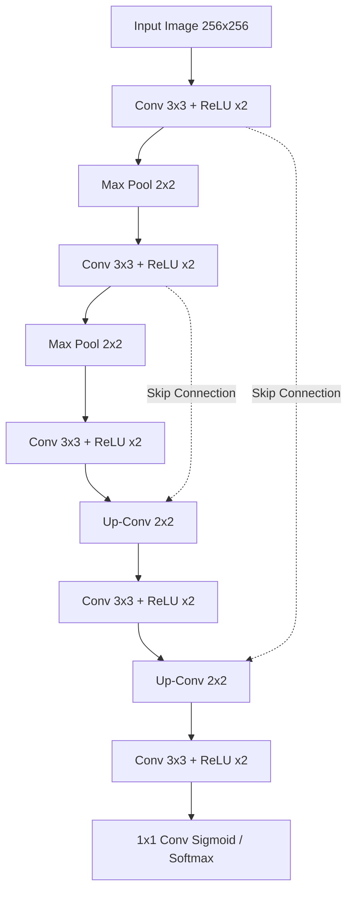

# Custom U-Net & CUDA GPU Benchmarking

This document details the custom U-Net model structure for segmentation and outlines the integration of parallel C++ CUDA kernels for real-time video processing.

---

## 1. Custom U-Net Architecture
U-Net is a convolutional neural network designed for fast and precise semantic segmentation. It consists of a contracting path (encoder) and an expansive path (decoder), giving it a symmetric "U" shape.



### Key Elements:
*   **Contracting Path (Encoder):** Repeated application of two $3 \times 3$ convolutions (unpadded), followed by ReLU and a $2 \times 2$ max pooling operation with stride 2 for downsampling. This doubles feature channels while halving resolution.
*   **Expansive Path (Decoder):** Up-convolves the feature map, followed by a $2 \times 2$ convolution that halves feature channels. Concatenates the corresponding cropped feature map from the contracting path (Skip Connection).
*   **Skip Connections:** Propagates high-resolution spatial details directly from the encoder to the decoder. This helps preserve precise boundaries (especially useful in medical imaging and road segmentation).

---

## 2. Custom CUDA Kernels
To bypass CPU bottlenecks in pixel manipulation, custom CUDA C++ kernels are written and compiled into Python bindings via PyBind11.

### Example Kernel: Parallel RGB to Grayscale
```cuda
__global__ void rgbToGrayscaleKernel(unsigned char* d_out, unsigned char* d_in, int width, int height) {
    int x = blockIdx.x * blockDim.x + threadIdx.x;
    int y = blockIdx.y * blockDim.y + threadIdx.y;
    
    if (x < width && y < height) {
        int idx = (y * width + x) * 3;
        int out_idx = y * width + x;
        
        unsigned char r = d_in[idx];
        unsigned char g = d_in[idx + 1];
        unsigned char b = d_in[idx + 2];
        
        // Luminosity formula (standard ITU-R BT.601 weights)
        d_out[out_idx] = static_cast<unsigned char>(0.299f * r + 0.587f * g + 0.114f * b);
    }
}
```

### Grid and Block Dimensions:
To process an image of size $W \times H$:
*   **Thread Block:** Typically configured as a 2D grid of size $16 \times 16$ or $32 \times 32$ threads.
*   **Grid Size:** Calculated dynamically to cover all pixels:
    $$\text{dimGrid} = \left( \lceil W / 16 \rceil, \lceil H / 16 \rceil \right)$$

---

## 3. Parallel GPU Benchmarking
To measure execution speedups, a benchmark loop isolates kernel execution from file loading or serialization operations.

### Measurement Framework:
We use CUDA events to measure GPU execution time with microsecond-level accuracy, avoiding CPU-GPU synchronization bottlenecks:

```cpp
cudaEvent_t start, stop;
cudaEventCreate(&start);
cudaEventCreate(&stop);

cudaEventRecord(start);

// Launch Kernel inside loop
for (int i = 0; i < iterations; ++i) {
    rgbToGrayscaleKernel<<<grid, block>>>(d_out, d_in, w, h);
}

cudaEventRecord(stop);
cudaEventSynchronize(stop);

float milliseconds = 0;
cudaEventElapsedTime(&milliseconds, start, stop);
float avg_time_us = (milliseconds * 1000.0f) / iterations;
```
This isolates kernel compute times from CPU memory copies (`cudaMemcpy`), allowing precise profiling of memory bandwidth and hardware occupancy.
